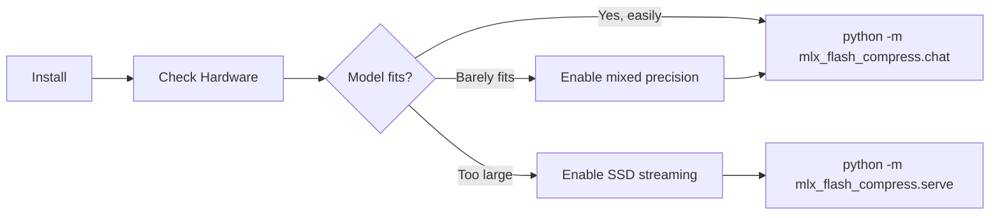

# Getting Started

## Prerequisites

- **Mac with Apple Silicon** (M1, M2, M3, M4, or M5 — any variant)
- **macOS 14+** (Sonoma or newer)
- **Python 3.10+**
- At least **16GB RAM** (more = better performance)

## Installation (2 minutes)

### Easiest: double-click on Mac

1. Open the project folder in Finder.
2. Double-click **Start pracownię.command**.
3. On first launch, keep the Terminal window open while Python packages and the default model are prepared. The browser opens when the server is ready.
4. Later, double-click **Zatrzymaj pracownię.command** to stop the local server and monitoring services.

The default model is a small 4-bit MoE suitable for starting on a 16 GB Mac. Its first download can take a while. Keep the project folder in place while the workbench is running. Logs are saved locally in `.local/runtime/server.log` and are not committed to Git.

Docker Desktop must be installed and open. MLX itself runs as a native macOS process to use Metal; Compose starts the local Prometheus and Grafana monitoring services. The monitoring ports bind only to this Mac.

### One-command terminal use

```bash
make up       # install once, start MLX + monitoring, open chat in browser
make status   # show whether the model is ready
make verify   # send small real requests and verify API behavior
make logs     # follow server logs
make down     # stop MLX and Docker services
make test     # run the containerized test suite
```

Choose a different model at startup with `make up MODEL=mlx-community/<model-name>`.

### Manual installation

```bash
# Clone the repo
git clone https://github.com/szibis/MLX-Flash.git
cd MLX-Flash

# Create virtual environment
uv venv && source .venv/bin/activate

# Install dependencies
uv pip install lz4 zstandard numpy psutil tabulate pytest mlx mlx-lm

# Build C acceleration library (optional but recommended)
make -C csrc install
```

## Your First Run

### 1. Check your hardware

```bash
python -m mlx_flash_compress.hardware
```

This shows your Mac's specs and what models you can run:

```
  Detected: Apple M3 Max, 36GB RAM, 1TB SSD

  Model                           Fits?  Hit%   tok/s
  Qwen MoE (5GB)                  YES    100%   115
  Mixtral-8x7B (26GB)             YES    100%    16
  DeepSeek-V3 (170GB)              NO     68%   3.7
```

### 2. Run with a model

```bash
# Small model (downloads ~5GB, fits in RAM)
python -m mlx_flash_compress.run \
  --model mlx-community/Qwen3-30B-A3B-4bit \
  --tokens 100

# With task-specific optimization
python -m mlx_flash_compress.run \
  --model mlx-community/Qwen3-30B-A3B-4bit \
  --task coding \
  --tokens 100

# With adaptive profiling (learns what you need)
python -m mlx_flash_compress.run \
  --model mlx-community/Qwen3-30B-A3B-4bit \
  --adaptive \
  --tokens 200
```

### 3. Find your optimal configuration

```bash
# For a specific model size on your hardware
python -m mlx_flash_compress.tier_optimizer \
  --total-ram 36 --model-gb 209 --layers 60 --experts 512

# Output: optimal RAM/SSD split, expected tok/s, cache hit rate
```



## Running the Server

The Rust binary is a single entry point that manages everything:

```bash
# Simplest — auto-selects model, launches Python worker, serves on :8080
mlx-flash-server --port 8080

# Specify model + number of workers
mlx-flash-server --port 8080 --model mlx-community/Qwen3-30B-A3B-4bit --workers 2

# With model preloading (loads into GPU before accepting requests)
mlx-flash-server --port 8080 --model mlx-community/Qwen3-30B-A3B-4bit --preload

# JSON structured logs + file output
mlx-flash-server --port 8080 --log-format json --log-file /var/log/mlx-flash.log

# Connect to existing Python worker (don't launch one)
mlx-flash-server --port 8080 --no-launch-worker --python-port 8081
```

**What happens on startup:**
1. Auto-detects Python venv (`.venv*/` in project, `VIRTUAL_ENV` env, or system `python3`)
2. Verifies `mlx_flash_compress` is importable (clear error if not installed)
3. Launches N Python workers on ports `8081-808N`
4. Health-checks each worker until ready (up to 15s, or 120s with `--preload`)
5. Starts Rust proxy on `:8080` — routes requests to workers
6. Background health checker every 10s — auto-restarts dead workers

**Monitoring:**
- Dashboard: http://localhost:8080/admin (live charts, worker management, logs)
- Chat: http://localhost:8080/chat
- Metrics: http://localhost:8080/metrics (Prometheus format)
- Grafana: `docker compose --profile monitoring up -d` → http://localhost:3000

**Worker management (no restart needed):**
```bash
curl -X POST http://localhost:8080/v1/models/switch -d '{"model":"mlx-community/Qwen3-8B-4bit"}'
curl -X POST http://localhost:8080/workers/restart -d '{"port":8081}'
curl -X POST http://localhost:8080/reload
curl -X POST http://localhost:8080/shutdown
```

## Configuration

### Quick: Environment variables

```bash
# Set cache size (MB)
export FLASH_CACHE_RAM_MB=8192

# Enable/disable features
export FLASH_ENABLE_PREFETCH=1
export FLASH_MIXED_PRECISION=1
export FLASH_SKIP_FALLBACK=0

python -m mlx_flash_compress.run --model <path>
```

### Full: Config file

Create `~/.config/mlx-flash/config.json`:

```json
{
  "cache": {
    "enable": true,
    "ram_mb": 0,
    "eviction": "lcp",
    "hot_algo": "lz4"
  },
  "prefetch": {
    "enable": true,
    "workers": 2
  },
  "mixed_precision": {
    "enable": true,
    "cold_bits": 2,
    "hot_bits": 4
  },
  "skip_fallback": {
    "enable": false
  },
  "ssd_protection": {
    "enable": true,
    "thermal_limit_c": 70
  },
  "engine": {
    "backend": "auto"
  }
}
```

Set `ram_mb` to `0` for auto-detection (uses 80% of available memory with safety margin).

## Running Tests

```bash
python -m pytest tests/ -v
# Expected: 89+ passed
```

## Rust Sidecar (optional, for production)

The Rust sidecar provides faster memory monitoring, SSE streaming, and expert caching.

### Build

```bash
cargo build --release -p mlx-flash-server
```

### Run

```bash
./mlx-flash-server/target/release/mlx-flash-server --launch-worker --preload --port 8080
```

### With expert caching

```bash
./mlx-flash-server/target/release/mlx-flash-server \
  --launch-worker --preload \
  --expert-dir /path/to/experts \
  --cache-mb 512 \
  --socket-path /tmp/mlx-flash-cache.sock
```

## Docker Compose and MLX on Mac

```bash
make up
make status
make verify
make down
```

Docker Desktop on macOS cannot expose Metal to the Linux inference container. The `make` commands therefore coordinate two parts: the MLX server runs natively on Apple Silicon, and Docker Compose runs the local monitoring and test services. `make test-native` runs the full Python suite on the Mac; `make test-e2e` and `make test-rust` run their respective containerized suites.

## Troubleshooting

**"MLX not available"**: You need Apple Silicon Mac. Intel Macs don't support MLX.

**"Model download fails"**: Set `HF_TOKEN` environment variable for Hugging Face authentication:
```bash
export HF_TOKEN=hf_your_token_here
```

**"libfastcache.dylib not found"**: Build it:
```bash
make -C csrc install
```

**"Out of memory"**: Reduce cache size:
```bash
python -m mlx_flash_compress.run --model <path> --cache-mb 2048
```

## Interactive Chat

The simplest way to use MLX-Flash:

```bash
python -m mlx_flash_compress.chat
```

Shows real-time memory status, tok/s per response, and warns when RAM is tight. Type `/status` to see memory info, `/clear` to reset conversation.

## API Server (LM Studio, continue.dev, OpenAI SDK)

Start the OpenAI-compatible API server:

```bash
python -m mlx_flash_compress.serve --model mlx-community/Qwen3-30B-A3B-4bit --port 8080
```

### Connect from LM Studio

1. Open LM Studio
2. Go to Settings -> Server
3. Set custom endpoint: `http://localhost:8080/v1`
4. Chat normally — our server handles inference + memory management

### Connect from continue.dev (VS Code)

Add to your `~/.continue/config.json`:

```json
{
  "models": [{
    "title": "Local MoE",
    "provider": "openai",
    "model": "local",
    "apiBase": "http://localhost:8080/v1",
    "apiKey": "not-needed"
  }]
}
```

### Connect from any OpenAI SDK client

```python
from openai import OpenAI
client = OpenAI(base_url="http://localhost:8080/v1", api_key="not-needed")
response = client.chat.completions.create(
    model="local",
    messages=[{"role": "user", "content": "Hello!"}],
)
print(response.choices[0].message.content)
```

### Server endpoints

| Endpoint | Method | Description |
|----------|--------|-------------|
| `/v1/chat/completions` | POST | Chat API (OpenAI-compatible) |
| `/v1/models` | GET | List available models |
| `/status` | GET | Memory, pressure, cache stats |
| `/health` | GET | Health check |

### Using with Ollama

Ollama uses `llama.cpp` as its backend, not MLX. Two options:

1. **Run our server alongside**: Our API server at `:8080`, Ollama at `:11434`. Use our server for MoE models that benefit from expert caching.
2. **Ollama with MLX backend**: If Ollama adds MLX support in the future, our memory management layer can integrate.

## Memory Management

The system automatically monitors your Mac's RAM:

```bash
# Check memory status anytime during chat
/status

# Or via the API
curl http://localhost:8080/status
```

**What it does:**
- Monitors macOS memory pressure in real-time
- Auto-sizes expert cache based on available RAM (2GB safety margin)
- Warns when pressure is critical ("close apps to prevent slowdown")
- Suggests actions: which apps to close, whether to use a smaller model

**For models that barely fit in RAM (the sweet spot):**

Mixed precision automatically reduces the model's memory footprint by ~20%:
- Hot experts stay at 4-bit (full quality)
- Cold experts compressed to 2-bit (minimal quality impact)
- Result: a model at 0.9x RAM goes from 43 tok/s -> 104 tok/s (measured)

## Benchmarks

```bash
# Memory pressure analysis (the key measurement)
python -m mlx_flash_compress.bench_memory_pressure --tokens 50

# ISP-like warm-up demo (watch cache fill in real-time)
python -m mlx_flash_compress.demo_warmup --topics coding writing coding math

# Real model routing with cache simulation
python -m mlx_flash_compress.cached_inference --tokens 80 --multi-topic
```

## What's Next

- Try different models to see scaling behavior
- Use `--task coding` or `--task writing` for task-specific optimization
- Run `python -m mlx_flash_compress.tier_optimizer` to find optimal settings
- Check `docs/integrations.md` for Claude Code, LM Studio, Cursor, Aider integration
- Check `docs/technical-reference.md` for deep implementation details
